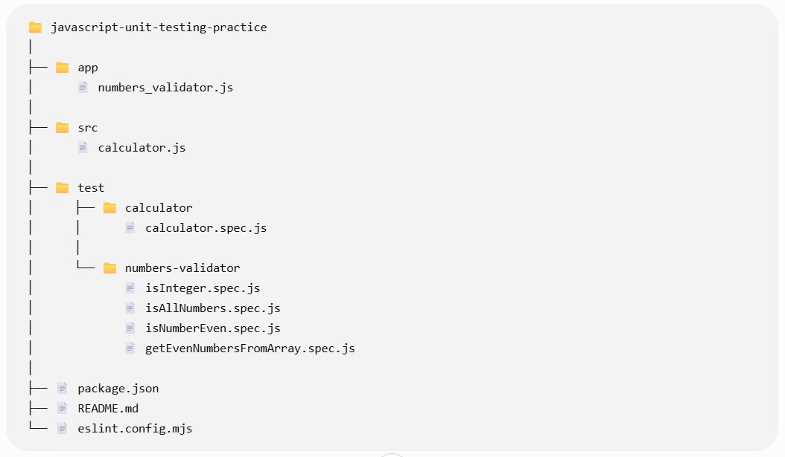
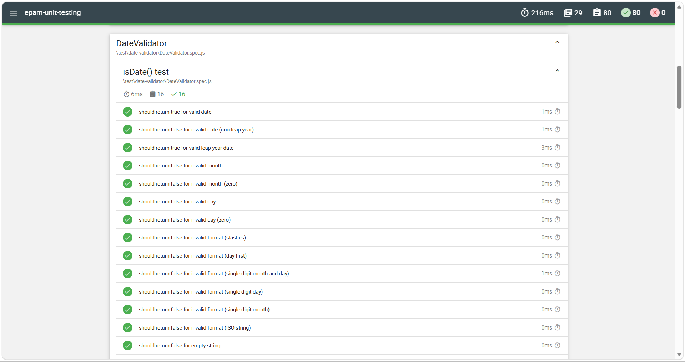
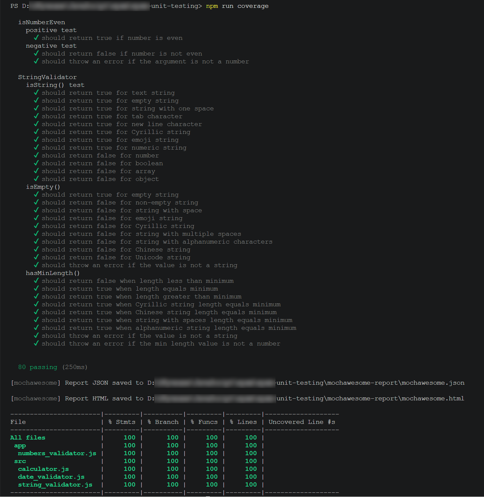

# JavaScript Unit Testing Practice


A learning project demonstrating unit testing in JavaScript using Mocha and Chai.

## Technology Stack

- JavaScript (ES6)
- Node.js
- Mocha
- Chai
- NYC
- Mochawesome
- ESLint
- Git
- GitHub Pages

---

## Skills Demonstrated

- Writing unit tests
- Test automation
- Assertion libraries
- Exception testing
- Data-driven testing
- Boundary Value Analysis
- Edge Case testing
- Code coverage analysis
- Git & GitHub
- Continuous project documentation

---

## Project Structure



---

## Project Overview

This project demonstrates automated unit testing in JavaScript using Mocha and Chai.

Implemented validators:

- Calculator
- NumbersValidator
- StringValidator
- DateValidator

The project includes:

- 80 automated tests
- 100% code coverage
- HTML test reports (Mochawesome)
- Data-driven tests
- Boundary Value Analysis
- Edge Case testing
- Exception handling tests

---

## About this project

This project was created to practice JavaScript unit testing and demonstrate software testing techniques used in real QA Automation projects.

It includes validators, structured test suites, data-driven tests, exception handling, boundary value analysis, edge case testing and full code coverage reporting.

---

## Test Results

80 unit tests successfully passed.



---

## Code Coverage

Current project coverage:

- Statements: **100%**
- Branches: **100%**
- Functions: **100%**
- Lines: **100%**



---

## Project Statistics

| Metric | Value |
|---------|------:|
| Validators | 4 |
| Tested methods | 13 |
| Test suites | 29 |
| Test cases | 80 |
| Coverage | 100% |
| Failed tests | 0 |

---

## Live Test Report

You can view the published Mochawesome report here:

[View Mochawesome Report](https://pilyaria.github.io/javascript-unit-testing-practice/)

---

## Run the project

Install dependencies

```bash
npm install
```

Run tests

```bash
npm test
```

Generate coverage

```bash
npm run coverage
```

---

## Implemented Components

This project was created as part of JavaScript Unit Testing practice.

Implemented tests for:

- Calculator
- Number validation
- Integer validation
- Even number validation
- Array validation
- Exception handling
- Date Validator

---

## Testing Techniques

This project demonstrates several software testing techniques:

- ✅ Positive Testing
- ✅ Negative Testing
- ✅ Boundary Value Analysis (BVA)
- ✅ Edge Case Testing
- ✅ Exception Testing
- ✅ Data-driven Testing
- ✅ Code Coverage Analysis

---

## Links

- [GitHub Repository](https://github.com/pilyaria/javascript-unit-testing-practice)
- [Live Mochawesome Report](https://pilyaria.github.io/javascript-unit-testing-practice/)
